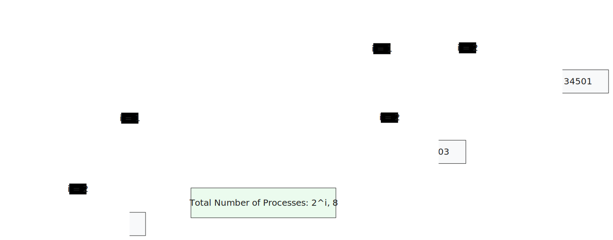

```
#include "stdio.h"
#include "sys/types.h"
#include "stdlib.h"
#include "unistd.h"

void main(int argc, char* const argv[]) {
    int i = 0;
    pid_t x;

    for (i=0;i<3;i++)        
        x = fork();
    printf("\tHello PID: [%d], PPID: [%d]\n", getpid(), getppid());
    // while(1);
}
```

### Compile and Run:
```bash
clear && gcc 00-basicFork.c -o 00-basicFork && ./00-basicFork 
```
### Output
```bash
    Hello PID: [34501], PPID: [5148]
    Hello PID: [34504], PPID: [34501]
    Hello PID: [34502], PPID: [34501]
    Hello PID: [34503], PPID: [34501]
    Hello PID: [34506], PPID: [34502]
    Hello PID: [34505], PPID: [34502]
    Hello PID: [34507], PPID: [34503]
    Hello PID: [34508], PPID: [34505]
```
### Process Diagram

